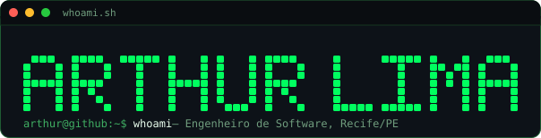
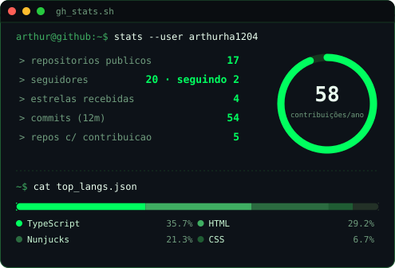
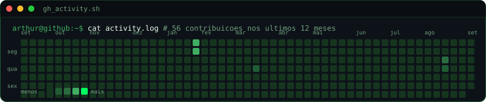

 

### `~$ cat manifesto.txt`

> tecnologia só faz sentido quando é **crítica**, **acessível** e **socialmente justa**.
> busco aplicar essa visão criando sistemas seguros, éticos e orientados a impacto real.
> — não existe código neutro. commit &amp; resist. **(Ⓐ)**

 

### `~$ cat about.md`

Engenheiro de software há pouco mais de 2 anos, 21 anos, Recife/PE. Antes de virar dev em tempo integral passei por suporte técnico, CRM e implementação — isso ajuda a pensar no sistema inteiro, não só no código que escrevo.

- › atualmente em: **Soluttions** — full-stack (React · TypeScript · Node.js · PostgreSQL)
- › cursando: Ciência da Computação (UNINTER) e Análise e Desenvolvimento de Sistemas (IFPE)
- › fundador da [Comunidade IV](https://instagram.com/comunidade.iv), comunidade de tecnologia de Recife
- › 1x Microsoft Azure Certified (AI-900)
- › contato: arthurhs1204@gmail.com

 

### `~$ ls ./stack`

  

 

### `~$ cat stats.log`

  

  

gerado a partir da API do GitHub — atualiza rodando <code>gen_stats_svg.py</code>

 

### `~$ ./contact --now`

  
  
  

 

© 2026 Arthur Lima — Recife/PE · feito no terminal, servido em markdown

